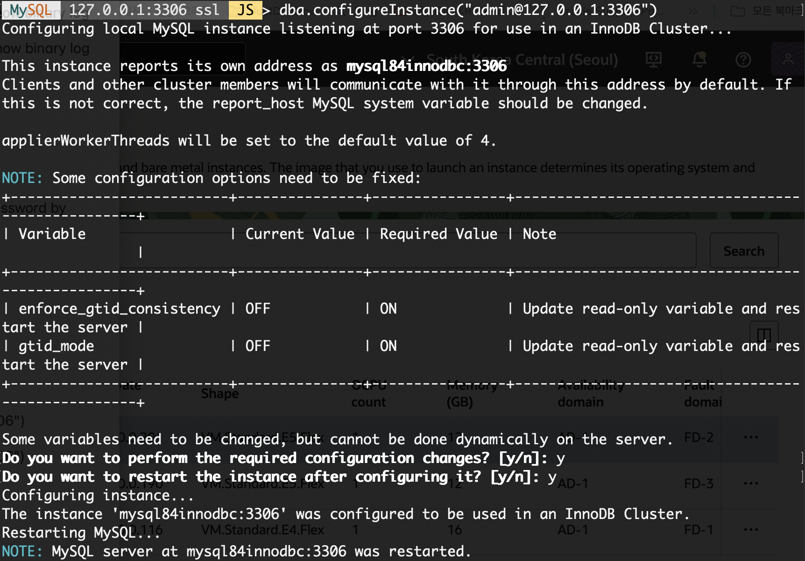
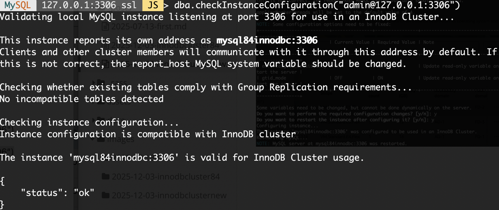
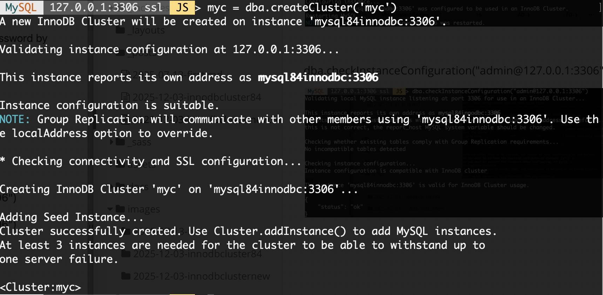
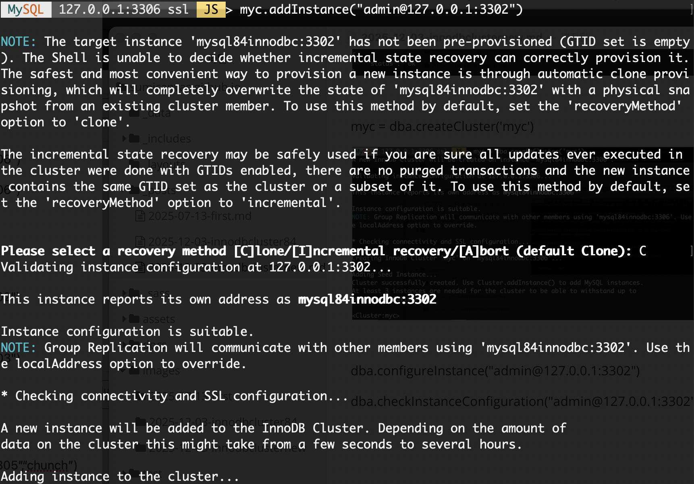
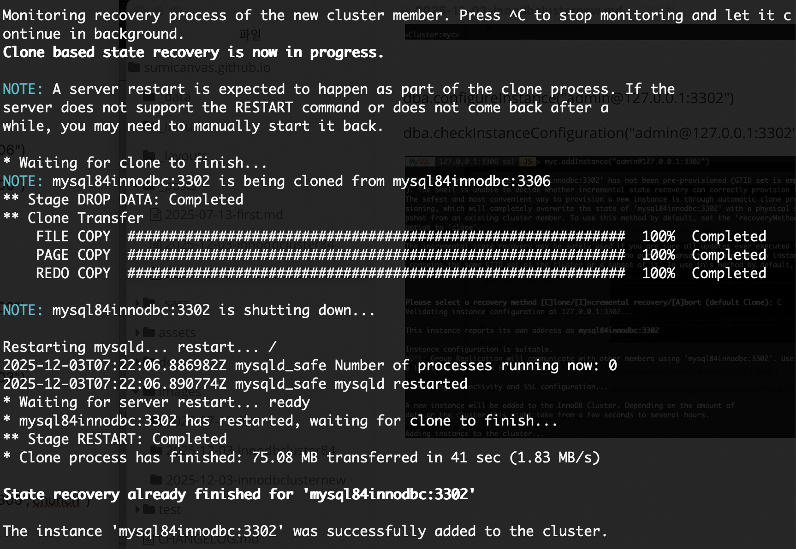
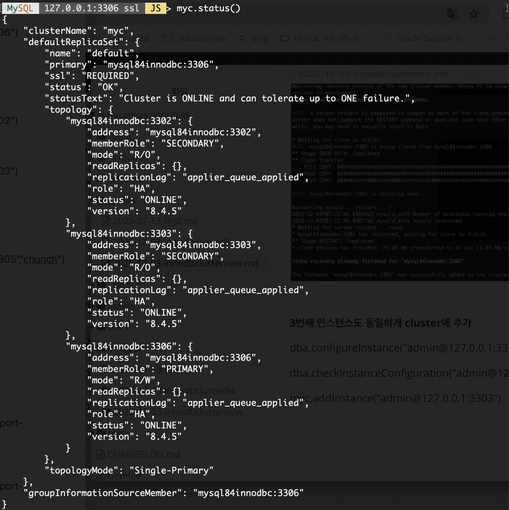

layout : single

title : " InnoDB Cluster with MySQL 8.4 에 대한 포스팅입니다."

**InnoDB Cluster 구성도 **

MySQL 8.4 에서 변경된 부분은 크게 없지만 옵션 설정부분이 변경된 부분이 있습니다.  InnoDB Cluster는 MySQL Router, MySQL Shell, Gruop Replication 으로 구성되어 있습니다.

**MySQL Router**  

R/W 포트 (6446, 64460) 로 Primary 멤버에 대한 자동 라우팅

R/O 포트(6447, 64470) 로 Secondary 멤버에 대한 자동 라우팅

Auto Port: 6450 (8.2 + )

**MySQL Shell**

JavaScript, Python 및 SQL 지원

도큐먼트 스토아와 함께 관계형 모델 지원  (X 프로토콜 및 MySQL 프로토콜 지원)

**InnoDB Cluster 생성 및 관리 API 제공**

운영에 필요한 여러가지 유틸리티 제공( ex. Dump Loading Utility)

명령어, 배치 스크립트 지원

**MySQL Group Replication**

자동으로 서버 페일오버, 그룹 멤버쉽 관리, 데이터 복제 등을 담당하는 핵심 컴포넌트

InnoDB 스토리지 엔진과 통합되어  GTID 기반으로 복제 제공

**1번째 인스턴스를 이용해 cluster 생성** 

$ mysqlsh admin@127.0.0.1:3306

> dba.checkInstanceConfiguration("admin@127.0.0.1:3306")

dba.checkInstanceConfiguration("admin@127.0.0.1:3306")

myc = dba.createCluster('myc')

**2번째 인스턴스  cluster에 추가** 

dba.configureInstance("admin@127.0.0.1:3302")

dba.checkInstanceConfiguration("admin@127.0.0.1:3302")

myc.addInstance("admin@127.0.0.1:3302")

인스턴스 추가 시 Clone 방식으로 추가합니다. 데이터가 많을 경우에는 첫번째 인스턴스를 백업 후 복구 후에  Incremetal 로 진행하시면 됩니다.

**3번째 인스턴스도 동일하게 cluster에 추가** 

dba.configureInstance("admin@127.0.0.1:3303")

dba.checkInstanceConfiguration("admin@127.0.0.1:3303")

myc.addInstance("admin@127.0.0.1:3303")

**생성된 클러스터 상태 확인 ** 

myc.status()

